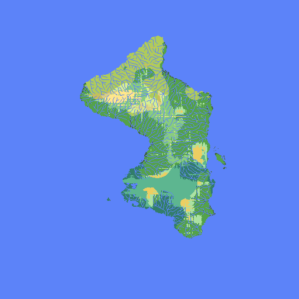
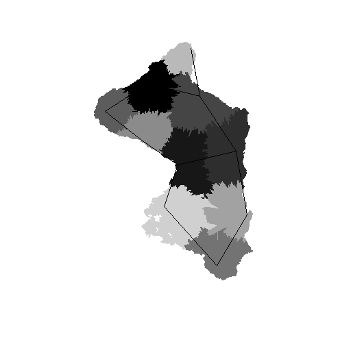

# noise_map

Generates map based off of noise. Creates temperature, moisture, and elevation noisemaps, creates river networks based off of them, then modifies noisemaps based off of river networks. Currently also picks city locations and creates provincial maps. Check wiki for more information.
